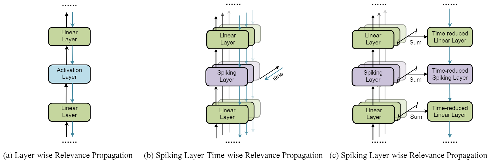
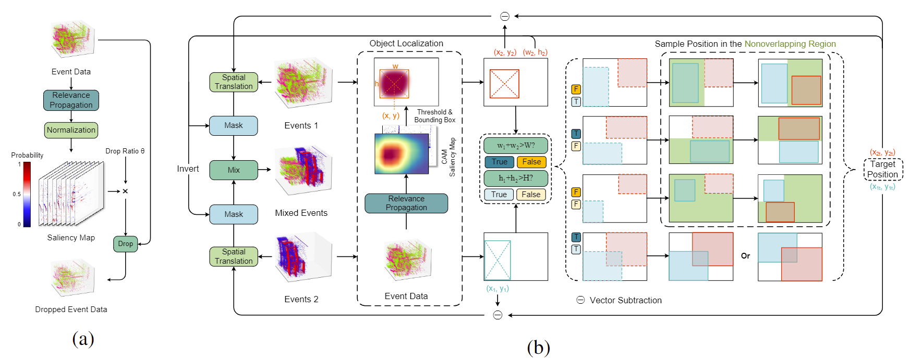

# EventRPG: Event Data Augmentation with Relevance Propagation Guidance

This repository is the code implementation of EventRPG, which offers:

1. A saliency map & CAM visualization tool for Spiking Neural Networks (SNNs).
2. An effective data augmentation method for event-based datasets on both Artificial Neural Networks (ANNs) and Spiking Neural Networks (SNNs).
## Citation
```
@inproceedings{sun2024eventrpg,
  title={Event{RPG}: Event Data Augmentation with Relevance Propagation Guidance},
  author={Sun, Mingyuan and Zhang, Donghao and Ge, Zongyuan and Wang, Jiaxu and Li, Jia and Fang, Zheng and Xu, Renjing},
  booktitle={International Conference on Learning Representations},
  year={2024},
  url={https://openreview.net/forum?id=i7LCsDMcZ4}
}
```
## Installation
```bash
conda env create -f eventrpg.yaml
```

## SLTRP & SLRP
Spiking Layer-Time-wise Relevance Propagation (SLTRP) and Spiking Layer-wise Relevance Propagation (SLRP)

### Example Code:
```python
import torch
from snn_utils.models import Classifier
# initialize model
model = Classifier(voxel_dimension=(timesteps, *event_resolution), device=device, crop_dimension=crop_dimension, relprop_mode=relprop_mode, classifier=classifier, num_classes=num_classes, spiking_neuron=spiking_neuron)
model.load_sate_dict(torch.load(model_save_path))
# obtain resized event representation
representation = model.quantization_layer.forward(events)
vox_resized = model.resize_to_resolution(representation)
# obtain saliency
saliency, output = model.classifier(vox_resized, str_target_layer, labels, alpha)
```
"str_target_layer" represents the target saliency layer you expect to obtain from the model. It can be either "long" denoting the saliency map or a combination of a method prefix, an underscore symbol and a target layer suffix. The method prefix includes "RelCAM", "SAM", None (SLTRP-CAM & SLRP-CAM). The target layer suffix includes "layer1", "layer2", "layer3", and "layer4" for SEW Resnet model, and "layer4" for Spiking VGG model (in this case, we extract the feature after the last convolutional layer in VGG model). Here are some examples:
```python
# RelCAM of layer 4
str_target_layer = "RelCAM_layer4"
# saliency map
str_target_layer = "long"
# SLTRP & SLRP of layer 3
str_target_layer = "layer3"
```
For the selection of other parameters, please refer to file ``snn_train.py`` for more details.
## RPG Data Augmentation


To utilize our augmentation approach for training models on event-based datasets, please:

1. Modify the dataset directories in the `get_dataset` function from ``utils/dataset.py``.

    N-Caltech101 and N-Cars datasets can be found [here](https://github.com/uzh-rpg/rpg_event_representation_learning).

    SL-Animals dataset can be found [here](https://github.com/AlbertoSabater/EventTransformer).
    
    N-Imagenet can be found [here](https://github.com/82magnolia/n_imagenet).

    CIFAR10-DVS and DVS-Gesture can be directly downloaded using [Spikingjelly](https://github.com/fangwei123456/spikingjelly).
2. For single GPU training, run SNN and ANN experiments through ``snn_train.py`` and ``train.py``, respectively. 

    For distributed training on multi-GPU, run SNN and ANN experiments through ``snn_train_distributed.py`` and ``train_distributed.py``, respectively.
